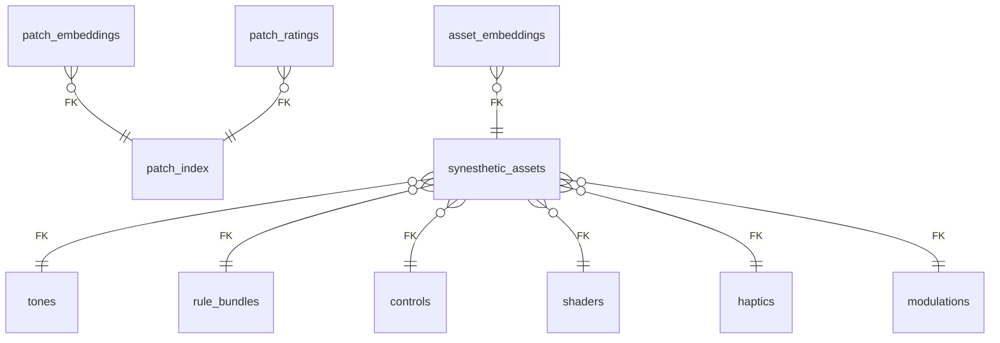

# Synesthetic Database Reference

## Item

| Column | Type | Key | Nullable | Description |
|--------|------|-----|----------|-------------|
| item_id | INTEGER | PK | True |  |
| name | VARCHAR |  | False |  |
| description | VARCHAR |  | False |  |
| createdAt | DATETIME |  | False |  |

## controls

| Column | Type | Key | Nullable | Description |
|--------|------|-----|----------|-------------|
| control_id | INTEGER | PK | True |  |
| name | VARCHAR |  | True |  |
| description | TEXT |  | False |  |
| meta_info | JSON |  | True |  |
| control_parameters | JSON |  | True |  |

## haptics

| Column | Type | Key | Nullable | Description |
|--------|------|-----|----------|-------------|
| haptic_id | INTEGER | PK | True |  |
| name | VARCHAR |  | True |  |
| description | TEXT |  | False |  |
| meta_info | JSON |  | True |  |
| device | JSON |  | True |  |
| input_parameters | JSON |  | False |  |

## mcp_command_log

| Column | Type | Key | Nullable | Description |
|--------|------|-----|----------|-------------|
| id | UUID | PK | True |  |
| timestamp | DATETIME |  | True |  |
| request_id | VARCHAR |  | True |  |
| asset_id | VARCHAR |  | False |  |
| command_type | VARCHAR |  | True |  |
| payload | JSON |  | True |  |
| result | JSON |  | False |  |
| status | VARCHAR |  | True |  |

## modulations

| Column | Type | Key | Nullable | Description |
|--------|------|-----|----------|-------------|
| modulation_id | INTEGER | PK | True |  |
| name | VARCHAR |  | True |  |
| description | TEXT |  | False |  |
| meta_info | JSON |  | True |  |
| modulations | JSON |  | True |  |

## patch_index

| Column | Type | Key | Nullable | Description |
|--------|------|-----|----------|-------------|
| patch_id | UUID | PK | True |  |
| asset_id | INTEGER |  | True |  |
| component_type | VARCHAR |  | True |  |
| base_version | INTEGER |  | False |  |
| state | VARCHAR |  | True |  |
| created_at | DATETIME |  | True |  |
| blob_uri | VARCHAR |  | True |  |

## proto_assets

| Column | Type | Key | Nullable | Description |
|--------|------|-----|----------|-------------|
| proto_asset_id | INTEGER | PK | True |  |
| name | VARCHAR |  | True |  |
| description | TEXT |  | False |  |
| proto_blob | BLOB |  | True |  |
| created_at | DATETIME |  | False |  |
| updated_at | DATETIME |  | False |  |

## rule_bundles

| Column | Type | Key | Nullable | Description |
|--------|------|-----|----------|-------------|
| id | INTEGER | PK | True |  |
| name | VARCHAR(128) |  | True |  |
| description | TEXT |  | False |  |
| meta_info | JSON |  | True |  |
| rules | JSON |  | True |  |
| created_at | DATETIME |  | True |  |
| updated_at | DATETIME |  | True |  |

## shader_libs

| Column | Type | Key | Nullable | Description |
|--------|------|-----|----------|-------------|
| shaderlib_id | INTEGER | PK | True |  |
| name | VARCHAR |  | True |  |
| definition | JSON |  | True |  |
| created_at | DATETIME |  | False |  |
| updated_at | DATETIME |  | False |  |

## shaders

| Column | Type | Key | Nullable | Description |
|--------|------|-----|----------|-------------|
| shader_id | INTEGER | PK | True |  |
| name | VARCHAR |  | True |  |
| description | TEXT |  | False |  |
| meta_info | JSON |  | False |  |
| vertex_shader | TEXT |  | True |  |
| fragment_shader | TEXT |  | True |  |
| shader_lib_id | INTEGER |  | False |  |
| uniforms | JSON |  | False |  |
| input_parameters | JSON |  | False |  |

## tones

| Column | Type | Key | Nullable | Description |
|--------|------|-----|----------|-------------|
| tone_id | INTEGER | PK | True |  |
| name | VARCHAR |  | True |  |
| description | TEXT |  | False |  |
| synth | JSON |  | False |  |
| input_parameters | JSON |  | False |  |
| effects | JSON |  | False |  |
| patterns | JSON |  | False |  |
| parts | JSON |  | False |  |
| meta_info | JSON |  | False |  |

## patch_embeddings

| Column | Type | Key | Nullable | Description |
|--------|------|-----|----------|-------------|
| patch_id | UUID | PK | True |  |
| embedding | VECTOR |  | True |  |

## patch_ratings

| Column | Type | Key | Nullable | Description |
|--------|------|-----|----------|-------------|
| patch_rating_id | INTEGER | PK | True |  |
| patch_id | UUID | FK | True |  |
| rating | INTEGER |  | True |  |
| comment | TEXT |  | False |  |
| created_at | DATETIME |  | False |  |

## synesthetic_assets

| Column | Type | Key | Nullable | Description |
|--------|------|-----|----------|-------------|
| synesthetic_asset_id | INTEGER | PK | True |  |
| name | VARCHAR |  | True |  |
| description | TEXT |  | False |  |
| meta_info | JSON |  | True |  |
| is_canonical | BOOLEAN |  | True |  |
| quality_tags | JSON |  | True |  |
| tone_id | INTEGER | FK | False |  |
| control_id | INTEGER | FK | False |  |
| shader_id | INTEGER | FK | False |  |
| haptic_id | INTEGER | FK | False |  |
| modulation_id | INTEGER | FK | False |  |
| rule_bundle_id | INTEGER | FK | False |  |
| created_at | DATETIME |  | False |  |
| updated_at | DATETIME |  | False |  |

## asset_embeddings

| Column | Type | Key | Nullable | Description |
|--------|------|-----|----------|-------------|
| id | INTEGER | PK | True |  |
| asset_id | INTEGER | FK | True |  |
| embedding | VECTOR |  | True |  |
| tags | JSON |  | True |  |
| structure | VARCHAR |  | False |  |
| model_version | VARCHAR |  | False |  |
| created_at | DATETIME |  | True |  |
